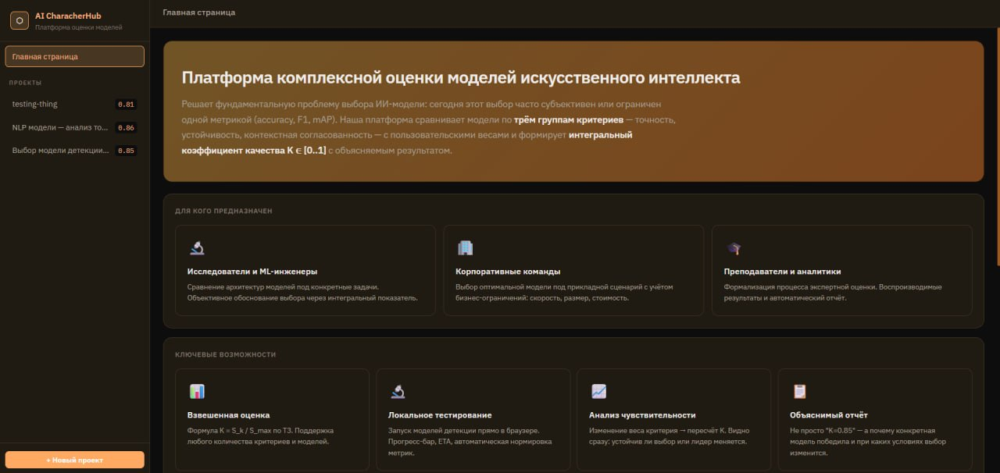
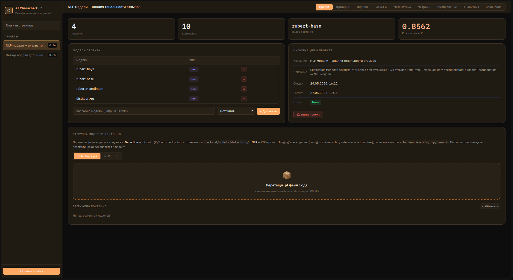
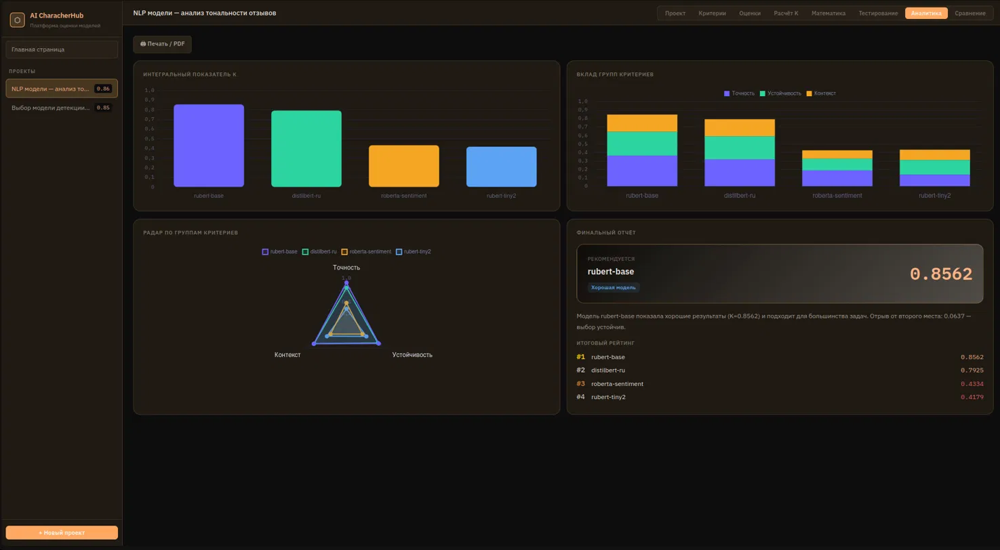
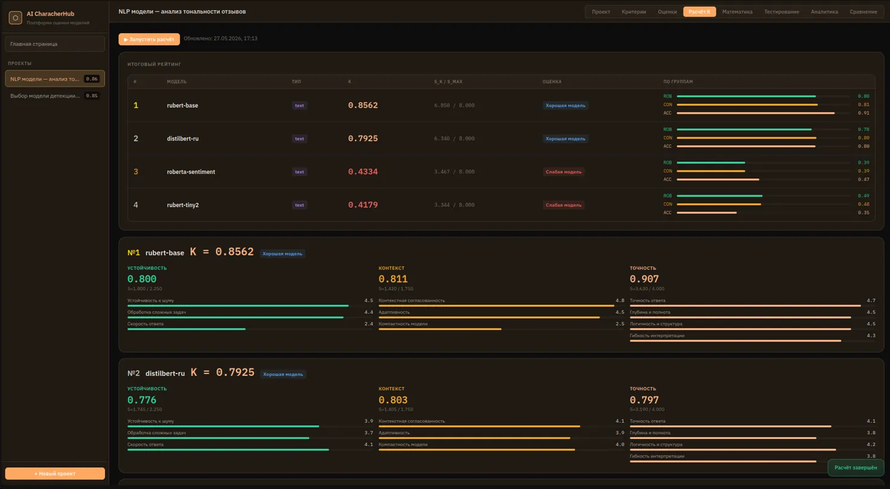
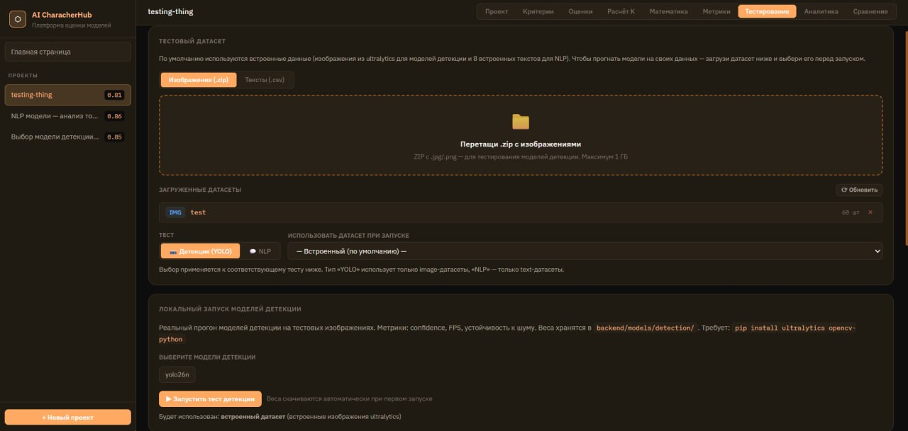
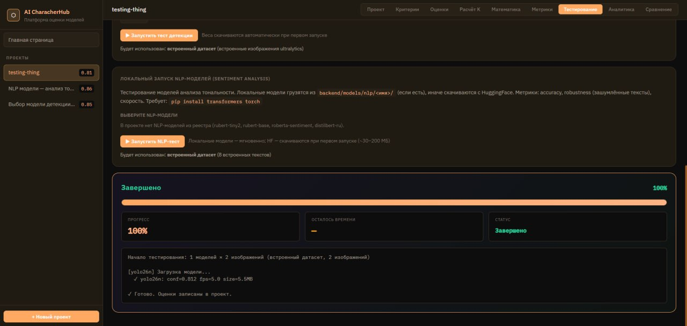

# AI CharacterHub

[](https://www.python.org/)
[](https://fastapi.tiangolo.com/)
[](https://github.com/woka00/ai-character-hub/commits/main)
[](https://github.com/woka00/ai-character-hub/stargazers)

> 🇬🇧 English below — 🇷🇺 [Русская версия](#русская-версия)

---

## Overview

**AI CharacterHub** is a web platform for objective comparison and benchmarking of AI models — LLMs, NLP pipelines, and computer vision models. It uses weighted evaluation criteria, a composite quality coefficient K ∈ [0..1], and sensitivity analysis to help teams make data-driven model selection decisions.

The platform runs locally, ships with two preloaded demo projects (object detection + sentiment analysis), and supports real model execution against either built-in samples or user-uploaded datasets.

---

## Screenshots

> **Main page**


> **Main dashboard — project overview with model leaderboard**


> **Analytics tab — bar, stacked, and radar charts**


> **K calculation tab — ranked results with per-criteria breakdown**


> **Testing tab — YOLO / NLP model benchmarking with progress bar and ETA**



---

## Features

9 interface tabs, each covering a distinct part of the evaluation workflow:

| Tab | Description |
|-----|-------------|
| 🏠 **Home** | Project overview, use cases, tab guide |
| 📁 **Project** | Dashboard: leader, model list, status |
| ⚖️ **Criteria** | Manage weights and groups, auto-normalize Σw=1 |
| ✏️ **Scores** | Model × criteria scoring matrix; manual or CSV import |
| 🧮 **K Score** | Run calculation, ranked results with breakdown |
| 📐 **Math** | All formulas + step-by-step K calculation per model |
| 📊 **Metrics** | Per-criterion metric reference: formulas, thresholds, what each score means |
| ⚡ **Testing** | Local YOLO / NLP benchmarking with live progress and ETA, custom datasets |
| 📈 **Analytics** | Bar/stacked/radar charts, final report with recommendation |
| 🔬 **Comparison** | Comparison table + sensitivity analysis |

Additional UX:
- **Drag-and-drop upload** for YOLO weights (`.pt`), NLP models (`.zip`), and datasets (image `.zip` or text `.csv`).
- **Per-scene dataset filter** in the Testing tab: the dataset selector shows only image datasets for YOLO and only text datasets for NLP.
- **Strict dataset binding**: when a custom dataset is explicitly selected, there is no silent fallback to built-in samples — invalid datasets return a 400 with a clear message.

---

## Quick Start

### Windows

```powershell
# (optional) Create a virtual environment
python -m venv venv
.\venv\Scripts\activate

# Install dependencies
python -m pip install -r requirements.txt

# Run
python backend\main.py
```

Or double-click `start.bat`.

### Linux / macOS

```bash
python3 -m venv venv
source venv/bin/activate
pip install -r requirements.txt
bash start.sh
```

Opens **http://localhost:8000** with two demo projects (Detection + NLP) preloaded.

> **Python version:** 3.10–3.12 required. Python 3.14 is not yet supported due to pydantic compatibility.

---

## Mathematical Model

```
S_k   = Σ (w_i × a_ik)     — weighted score sum for model k
S_max = 5 × Σ w_i           — maximum possible score
K_k   = S_k / S_max          — quality coefficient [0..1]
```

**K interpretation:**

| Range | Rating |
|-------|--------|
| 0.90 – 1.00 | Excellent — recommended |
| 0.75 – 0.89 | Good |
| 0.60 – 0.74 | Acceptable |
| 0.40 – 0.59 | Weak |
| 0.00 – 0.39 | Not recommended |

All formulas are rendered interactively on the **📐 Math** tab. The **📊 Metrics** tab documents each criterion (what is measured, normalization formula, score thresholds).

---

## Project Structure

```
ai-character-hub/
├── backend/
│   ├── main.py             # FastAPI app, math model, auto-seed, local testing workers
│   ├── evaluator.py        # CLI tool for automated model evaluation
│   ├── seed_demo.py        # Manual demo data seeding (auto-seed handles this on first run)
│   ├── ai_eval.db          # SQLite database (created on first run)
│   ├── models/
│   │   ├── detection/      # YOLO .pt weights (auto-downloaded or drag-and-drop)
│   │   └── nlp/            # HuggingFace model cache (auto-downloaded or drag-and-drop)
│   └── datasets/           # User-uploaded datasets (drag-and-drop in UI)
│       └── <name>/
│           ├── images/     # for YOLO (image dataset)
│           ├── texts.csv   # for NLP (text dataset, columns: text,label)
│           └── meta.json
├── frontend/
│   └── index.html          # SPA — 9 tabs, no build step required
├── docs/screenshots/
├── requirements.txt
├── start.bat               # Windows launcher
├── start.sh                # Linux/macOS launcher
└── README.md
```

### Environment variables

All paths can be overridden without editing code:

| Variable | Default | Purpose |
|----------|---------|---------|
| `YOLO_MODELS_DIR` | `backend/models/detection` | Where YOLO `.pt` weights are stored |
| `NLP_MODELS_DIR`  | `backend/models/nlp` | HuggingFace model cache |
| `DATASETS_DIR`    | `backend/datasets` | User-uploaded image / text datasets |
| `DB_PATH`         | `backend/ai_eval.db` | SQLite file |

---

## Adding New Models

### Option 1 — Via UI

1. Open your project → **Project** tab → enter model name (e.g. `YOLOv9c`) and type
2. Click **+ Add**
3. Go to **Scores** tab and fill in the evaluation matrix
4. Go to **K Score** tab → click **Run Calculation**

### Option 2 — Local Automated Testing

**YOLO (detection):** drop a `.pt` file onto the Testing tab upload zone, or place it in `backend/models/detection/`, then register it in `_yolo_test_worker` (`backend/main.py`):

```python
weight_map = {
    'YOLOv8n': 'yolov8n.pt',
    # Add your model here:
    'YOLOv9c': 'yolov9c.pt',
}
```

**NLP (sentiment):** drop a HuggingFace model `.zip` (containing `config.json` + weights) onto the Testing tab, or add it to `NLP_MODEL_REGISTRY` in `backend/main.py`:

```python
NLP_MODEL_REGISTRY = {
    'rubert-tiny2': 'cointegrated/rubert-tiny2',
    # Add your model here:
    'my-label':     'huggingface/model-id',
}
```

Local folders (`backend/models/nlp/<name>/`) take priority over the HuggingFace registry — fully offline if `config.json` is present.

Requires:
```bash
pip install ultralytics opencv-python      # for YOLO
pip install transformers torch              # for NLP
```

### Option 3 — CSV Import

Prepare a CSV:
```
model_name,criterion_name,score
YOLOv9c,Accuracy,4.6
YOLOv9c,Speed,3.8
```

Go to **Scores** tab → click **📂 Import CSV**.

---

## Using Custom Datasets

### Upload via UI

On the **Testing** tab, use the dataset upload zone:
- **Images** (`.zip` archive of `.jpg` / `.png`) — for YOLO benchmarking
- **Texts** (`.csv` with columns `text,label` where `label ∈ pos/neg/neu`) — for NLP benchmarking

Uploaded datasets land in `backend/datasets/<name>/` and immediately appear in the dataset selector. Toggle between **📷 YOLO** and **💬 NLP** above the selector — the list filters by type so you cannot pick a text dataset for a detection test.

### Run via CLI

`backend/evaluator.py` accepts a `--dataset NAME` flag that maps directly to `DATASETS_DIR/<NAME>/`:

```bash
# YOLO on a custom image dataset
python backend/evaluator.py --project_id 1 --model_type detection --dataset my-photos

# NLP on a custom text dataset
python backend/evaluator.py --project_id 1 --model_type text --dataset my-reviews

# Without --dataset → built-in samples (COCO8 / 5 demo texts)
python backend/evaluator.py --project_id 1 --model_type detection --dry_run
```

If the dataset is missing or empty, the script raises `FileNotFoundError` instead of silently falling back to built-in data.

---

## API Endpoints

### Projects, models, criteria, scoring

| Method | URL | Description |
|--------|-----|-------------|
| GET | `/api/projects` | List projects |
| POST | `/api/projects` | Create project |
| GET | `/api/projects/{id}` | Project details |
| DELETE | `/api/projects/{id}` | Delete project |
| POST | `/api/projects/{id}/models` | Add model |
| DELETE | `/api/projects/{id}/models/{mid}` | Remove model |
| GET / POST / PUT / DELETE | `/api/projects/{id}/criteria[...]` | Manage criteria |
| POST | `/api/projects/{id}/criteria/normalize` | Normalize weights |
| GET / POST | `/api/projects/{id}/scores[...]` | Manage scores |
| POST | `/api/projects/{id}/scores/import` | CSV import |
| POST | `/api/projects/{id}/calculate` | Run K calculation |
| GET | `/api/projects/{id}/results` | Latest results |
| POST | `/api/projects/{id}/sensitivity` | Sensitivity analysis |
| GET | `/api/projects/{id}/report` | Final report |

### Local testing

| Method | URL | Description |
|--------|-----|-------------|
| **POST** | `/api/projects/{id}/test/start` | Start local YOLO test (body: `{model_names, dataset?}`) |
| **POST** | `/api/projects/{id}/test/nlp/start` | Start local NLP test (body: `{model_names, dataset?}`) |
| **GET** | `/api/test/{job_id}` | Polling: status, progress, ETA, log |

When `dataset` is omitted → built-in samples. When provided → strict use of `DATASETS_DIR/<name>/`; mismatched type returns **400**.

### Uploads

| Method | URL | Description |
|--------|-----|-------------|
| POST | `/api/upload/yolo` | Upload `.pt` weights → `YOLO_MODELS_DIR` |
| POST | `/api/upload/nlp` | Upload HuggingFace model `.zip` → `NLP_MODELS_DIR` |
| POST | `/api/datasets/upload?kind=images\|texts` | Upload dataset → `DATASETS_DIR` |
| GET | `/api/datasets` | List uploaded datasets |
| DELETE | `/api/datasets/{name}` | Delete a dataset |

Full Swagger docs: **http://localhost:8000/docs**

---

## Tech Stack

| Layer | Technology |
|-------|------------|
| Backend | FastAPI + SQLite |
| Frontend | HTML/CSS/JS + Chart.js (no build step) |
| ML (optional) | ultralytics (YOLO), transformers + torch (NLP) |

---

---

# Русская версия

[](https://www.python.org/)
[](https://fastapi.tiangolo.com/)

## Платформа комплексной оценки моделей искусственного интеллекта

Веб-система для объективного сравнения ИИ-моделей по группам критериев с весами, интегральным коэффициентом качества K ∈ [0..1] и анализом чувствительности.

Запускается локально, при первом старте автоматически создаёт два демо-проекта (детекция объектов + анализ тональности), поддерживает реальный прогон моделей как на встроенных, так и на пользовательских датасетах.

---

## Скриншоты

> **Главная страница**


> **Главный дашборд — обзор проекта и лидерборд моделей**


> **Вкладка «Аналитика» — bar, stacked и radar чарты**


> **Вкладка «Расчёт K» — рейтинг с детализацией по критериям**


> **Вкладка «Тестирование» — прогон YOLO / NLP с прогресс-баром и ETA**


---

## Быстрый старт

### Windows

```powershell
# (опционально) виртуальное окружение
python -m venv venv
.\venv\Scripts\activate

# Зависимости
python -m pip install -r requirements.txt

# Запуск
python backend\main.py
```

Или двойной клик на `start.bat`.

### Linux / macOS

```bash
python3 -m venv venv
source venv/bin/activate
pip install -r requirements.txt
bash start.sh
```

Откроется **http://localhost:8000** с двумя готовыми демо-проектами (Detection + NLP).

> **Версия Python:** требуется 3.10–3.12. Python 3.14 пока не поддерживается из-за несовместимости с pydantic.

---

## Возможности

### 9 вкладок интерфейса

| Вкладка | Описание |
|---------|----------|
| 🏠 **Главная** | Описание проекта, для кого предназначен, обзор всех вкладок |
| 📁 **Проект** | Дашборд: лидер рейтинга, модели, статус |
| ⚖️ **Критерии** | Управление весами и группами критериев, нормировка Σw=1 |
| ✏️ **Оценки** | Матрица оценок модели × критерии. Ввод вручную или импорт CSV |
| 🧮 **Расчёт K** | Запуск расчёта по формулам ТЗ, рейтинг с детализацией |
| 📐 **Математика** | Все формулы с подписями + пошаговый расчёт K для каждой модели |
| 📊 **Метрики** | Описание каждого критерия: формула, пороги, что значит каждая оценка |
| ⚡ **Тестирование** | Локальный прогон YOLO / NLP с прогресс-баром и ETA, поддержка своих датасетов |
| 📈 **Аналитика** | Bar/stacked/radar чарты, финальный отчёт с рекомендацией |
| 🔬 **Сравнение** | Сравнительная таблица + анализ чувствительности |

Дополнительно:
- **Drag-and-drop загрузка** весов YOLO (`.pt`), NLP-моделей (`.zip`) и датасетов (`.zip` с картинками или `.csv` с текстами).
- **Фильтрация датасетов по сцене** на вкладке Тестирование: переключатель «📷 YOLO / 💬 NLP» оставляет в селекте только датасеты подходящего типа.
- **Строгая привязка**: при явном выборе датасета silent fallback на встроенные данные отключён — если файлов нет или тип не совпадает, API вернёт 400 с понятным сообщением.

---

## Структура проекта

```
ai-character-hub/
├── backend/
│   ├── main.py             # FastAPI + математическая модель + auto-seed + локальное тестирование
│   ├── evaluator.py        # CLI-утилита для автоматической оценки моделей
│   ├── seed_demo.py        # Ручное наполнение демо-данными (auto-seed делает это сам)
│   ├── ai_eval.db          # SQLite (создаётся при первом запуске)
│   ├── models/
│   │   ├── detection/      # веса YOLO (.pt) — автозагрузка или drag-and-drop
│   │   └── nlp/            # кэш HuggingFace NLP-моделей
│   └── datasets/           # пользовательские датасеты (drag-and-drop)
│       └── <имя>/
│           ├── images/     # для YOLO (датасет изображений)
│           ├── texts.csv   # для NLP (колонки: text,label)
│           └── meta.json
├── frontend/
│   └── index.html          # SPA — 9 вкладок, без сборки
├── docs/screenshots/
├── requirements.txt
├── start.bat               # Запуск на Windows
├── start.sh                # Запуск на Linux/macOS
└── README.md
```

### Переменные окружения

Все пути можно переопределить без правки кода:

| Переменная | По умолчанию | Назначение |
|------------|--------------|------------|
| `YOLO_MODELS_DIR` | `backend/models/detection` | Папка для весов YOLO |
| `NLP_MODELS_DIR`  | `backend/models/nlp` | Кэш HuggingFace моделей |
| `DATASETS_DIR`    | `backend/datasets` | Пользовательские датасеты |
| `DB_PATH`         | `backend/ai_eval.db` | SQLite-файл |

---

## Математическая модель

```
S_k   = Σ (w_i × a_ik)     — взвешенная сумма оценок модели k
S_max = 5 × Σ w_i           — максимально возможная сумма
K_k   = S_k / S_max          — итоговый коэффициент качества [0..1]
```

**Интерпретация K:**

| Диапазон | Оценка |
|----------|--------|
| 0.90 – 1.00 | Отличная модель — рекомендуется |
| 0.75 – 0.89 | Хорошая модель |
| 0.60 – 0.74 | Приемлемая модель |
| 0.40 – 0.59 | Слабая модель |
| 0.00 – 0.39 | Не рекомендуется |

Все формулы интерактивно показаны на вкладке **📐 Математика**. Описание метрик с порогами и нормировкой — на вкладке **📊 Метрики**.

---

## ⚙️ Как внедрять новые модели

### Способ 1 — через UI

1. Открой проект → вкладка «Проект» → введи название (напр. `YOLOv9c`) и тип
2. Нажми «+ Добавить»
3. Перейди на вкладку «Оценки» и заполни матрицу
4. На вкладке «Расчёт K» нажми «Запустить расчёт»

### Способ 2 — автоматическое локальное тестирование

**YOLO (детекция):** перетащи `.pt`-файл в зону загрузки на вкладке Тестирование (или положи руками в `backend/models/detection/`) и пропиши в `_yolo_test_worker` (`backend/main.py`):

```python
weight_map = {
    'YOLOv8n': 'yolov8n.pt',
    # Добавь сюда свою модель:
    'YOLOv9c': 'yolov9c.pt',
}
```

**NLP (тональность):** перетащи `.zip` с HuggingFace-моделью (`config.json` + веса) на ту же вкладку, либо добавь в `NLP_MODEL_REGISTRY` в `backend/main.py`:

```python
NLP_MODEL_REGISTRY = {
    'rubert-tiny2': 'cointegrated/rubert-tiny2',
    # Добавь свою:
    'мой-ярлык':    'huggingface/model-id',
}
```

Локальные папки (`backend/models/nlp/<имя>/`) имеют приоритет над реестром HuggingFace — полностью офлайн при наличии `config.json`.

Требует:
```bash
pip install ultralytics opencv-python      # для YOLO
pip install transformers torch              # для NLP
```

### Способ 3 — массовый импорт через CSV

```
model_name,criterion_name,score
YOLOv9c,Точность ответа,4.6
YOLOv9c,Скорость ответа,3.8
```

Вкладка «Оценки» → «📂 Импорт CSV».

---

## Использование своих датасетов

### Через UI

На вкладке **⚡ Тестирование** в карточке «Загрузка датасетов»:
- **Изображения** (`.zip` с `.jpg`/`.png`) — для YOLO-теста.
- **Тексты** (`.csv` с колонками `text,label` где `label ∈ pos/neg/neu`) — для NLP-теста.

Загруженные датасеты появляются в селекте «Использовать датасет при запуске». Переключатель «📷 Детекция (YOLO) / 💬 NLP» над селектом фильтрует список по типу — нельзя случайно подать текстовый датасет в YOLO-тест. Под каждой кнопкой запуска показывается «Будет использован: …» — явное подтверждение того, что реально пойдёт в прогон.

### Через CLI

`backend/evaluator.py` принимает флаг `--dataset NAME`, который указывает на `DATASETS_DIR/<NAME>/`:

```bash
# YOLO на своём датасете изображений
python backend/evaluator.py --project_id 1 --model_type detection --dataset my-photos

# NLP на своём датасете текстов
python backend/evaluator.py --project_id 1 --model_type text --dataset my-reviews

# Без --dataset → встроенные данные (COCO8 / 5 демо-текстов)
python backend/evaluator.py --project_id 1 --model_type detection --dry_run
```

Если датасет отсутствует или пустой — скрипт падает с `FileNotFoundError`, а не молча использует встроенный.

---

## Нормировка метрик в шкалу 1–5

```python
# Монотонно возрастающие (больше = лучше)
acc_score = round(avg_conf * 5, 2)

# Монотонно убывающие (меньше = лучше)
size_score = (5.0 if size_mb < 10 else 4.0 if size_mb < 30
              else 3.0 if size_mb < 80 else 2.0)

# Пороговые шкалы (FPS, latency)
speed_score = (5.0 if avg_fps >= 30 else 4.0 if avg_fps >= 15
               else 3.0 if avg_fps >= 5 else 2.0 if avg_fps >= 2 else 1.0)
```

---

## API эндпоинты

### Проекты, модели, критерии, оценки

| Метод | URL | Описание |
|-------|-----|----------|
| GET | `/api/projects` | Список проектов |
| POST | `/api/projects` | Создать проект |
| GET | `/api/projects/{id}` | Детали проекта |
| DELETE | `/api/projects/{id}` | Удалить проект |
| POST | `/api/projects/{id}/models` | Добавить модель |
| DELETE | `/api/projects/{id}/models/{mid}` | Удалить модель |
| GET / POST / PUT / DELETE | `/api/projects/{id}/criteria[...]` | Управление критериями |
| POST | `/api/projects/{id}/criteria/normalize` | Нормировать веса |
| GET / POST | `/api/projects/{id}/scores[...]` | Управление оценками |
| POST | `/api/projects/{id}/scores/import` | Импорт CSV |
| POST | `/api/projects/{id}/calculate` | Запустить расчёт K |
| GET | `/api/projects/{id}/results` | Последние результаты |
| POST | `/api/projects/{id}/sensitivity` | Анализ чувствительности |
| GET | `/api/projects/{id}/report` | Финальный отчёт |

### Локальное тестирование

| Метод | URL | Описание |
|-------|-----|----------|
| **POST** | `/api/projects/{id}/test/start` | Запустить YOLO-тест (body: `{model_names, dataset?}`) |
| **POST** | `/api/projects/{id}/test/nlp/start` | Запустить NLP-тест (body: `{model_names, dataset?}`) |
| **GET** | `/api/test/{job_id}` | Статус, прогресс, ETA, лог |

Если `dataset` опущен — используется встроенный. Если указан — строго `DATASETS_DIR/<name>/`; несовместимый тип → **400**.

### Загрузки

| Метод | URL | Описание |
|-------|-----|----------|
| POST | `/api/upload/yolo` | Загрузить `.pt` веса → `YOLO_MODELS_DIR` |
| POST | `/api/upload/nlp` | Загрузить HuggingFace-модель `.zip` → `NLP_MODELS_DIR` |
| POST | `/api/datasets/upload?kind=images\|texts` | Загрузить датасет → `DATASETS_DIR` |
| GET | `/api/datasets` | Список загруженных датасетов |
| DELETE | `/api/datasets/{name}` | Удалить датасет |

Swagger: **http://localhost:8000/docs**

---

## Стек

| Слой | Технология |
|------|------------|
| Backend | FastAPI + SQLite |
| Frontend | HTML/CSS/JS + Chart.js (без сборки) |
| ML (опционально) | ultralytics (YOLO), transformers + torch (NLP) |

---
